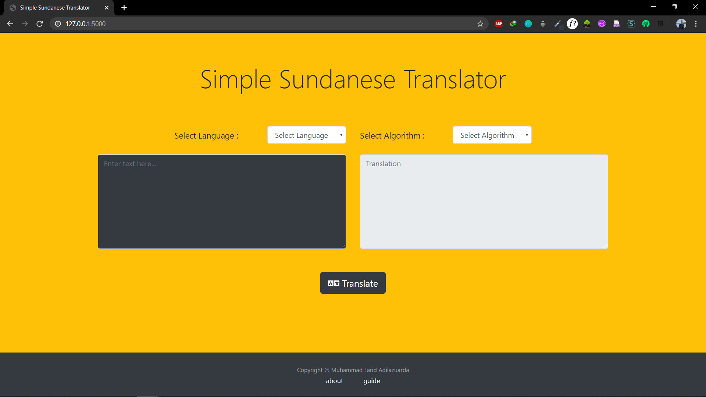

# Simple Sundanese Translator
Simple Sundanese to Bahasa Indonesia translator using Pattern Matching

## Latar Belakang
Pada suatu hari, ada mahasiswa bernama Riyugan yang baru pindah ke Bandung. Pada awalnya dia mengalami kesulitan untuk bersosialisai dengan lingkungan sekitar karena orang-orang di lingkungannya yang baru hanya berbicara dalam bahasa Sunda. Beruntungnya Riyugan punya teman dari kampung halamannya, yaitu Anda, untuk diminta membuat penerjemah sederhana dari Bahasa Sunda ke Bahasa Indonesia begitu pula sebaliknya untuk memudahkan dirinya bersosialisasi dengan lingkungan barunya di Bandung.

## Deskripsi
Program Simple Sundenese Translator adalah sebuah program sederhana berbasis website yang berguna untuk menerjemahkan kalimat berbahasa Indonesia ke bahasa Sunda ataupun sebaliknya. Program ini dapat menghapus dan menambahkan partikel penegas 'Teh' dalam bahasa Sunda. Pengguna dapat memilih algoritma pencocokan string yang digunakan, tersedia algoritma Knuth-Morris-Pratt (KMP), algoritma Boyer-Moore (BM), dan Regular Expression (Regex). Pengguna juga dapat memilih metode pencarian kata yang digunakan, tersedia pilihan cari semua kata yang cocok dalam kamus atau kata pertama yang ditemukan.

## Getting Started
### Prerequisites
1. python 3(versi 3.x.x)
```
Windows : download python dari https://www.python.org/downloads/windows/ dan lakukan instalasi
Linux : sudo apt-get install python3
```
2. Flask 1.1.2
```
Windows: pip install -U flask
Linux : sudo apt install python3-flask
```
3. Web Browser
Developer menggunakan google chrome yang dapat diunduh dari laman :
```
https://www.google.com/intl/id_id/chrome/
```

### Instalasi
1. Buka cmd atau terminal di directory folder src
2. Jalankan perintah berikut di cmd atau terminal
```
Windows : python app.py
Linux : python3 app.py
```
3. Akan muncul tulisan berikut di cmd atau terminal
 * Serving Flask app "app" (lazy loading)
 * Environment: production
   WARNING: This is a development server. Do not use it in a production deployment.
   Use a production WSGI server instead.
 * Debug mode: on
 * Restarting with stat
 * Debugger is active!
 * Debugger PIN: 272-213-661
 * Running on http://127.0.0.1:5000/ (Press CTRL+C to quit)
4. Klik alamat http://127.0.0.1:5000/
5. Akan langsung ter redirect ke halaman translator

## Testcase
```
Sunda - Indonesia
Sunda : nami abdi Riyugan
Indonesia : nama saya Riyugan
```

```
Sunda - Indonesia
Sunda : abdi teh sanes jalma Bandung
Indonesia : saya bukan orang Bandung
```

```
Sunda - Indonesia
Sunda : anjeun sumping ti mana?
Indonesia : kamu tiba dari mana?
```

```
Indonesia - Sunda
Indonesia : nama saya Riyugan
Sunda : nami abdi Riyugan
```

```
Indonesia - Sunda
Indonesia : nama adik kamu siapa?
Sunda : nami rai anjeun teh saha?
```

```
Indonesia - Sunda
Indonesia : saya tidak bisa bahasa Sunda
Sunda : abdi henteu tiasa bahasa Sunda
```

## Sample Screen


## Video demo
Video demo aplikasi dapat dilihat pada link :
https://youtu.be/9BNrfFI-cw8


## Built With
* [Python](https://docs.python.org/3/) - Backend
* [Bootstrap](https://getbootstrap.com/) - Website beautifier
* [Flask](https://pypi.org/project/Flask/) - Backend

## Author
**Muhammad Farid Adilazuarda / 13518040** - *Programmer, Tester*
